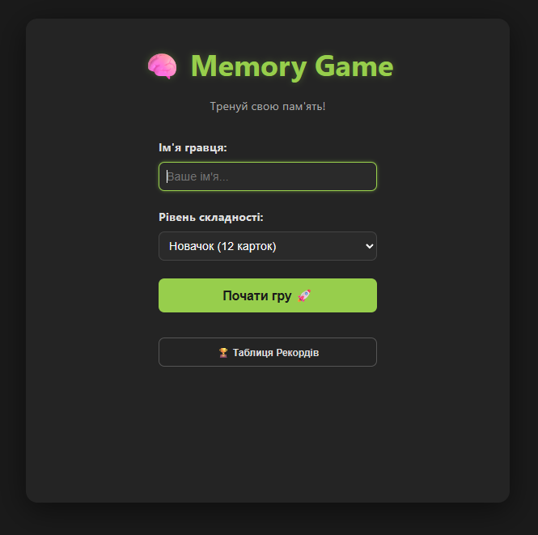
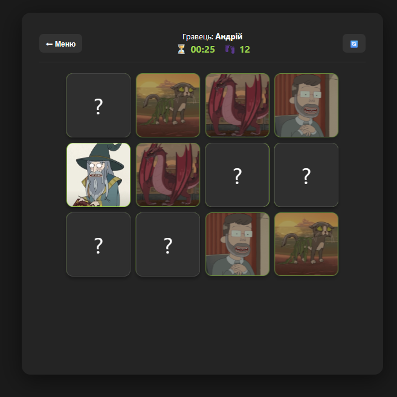
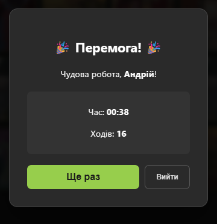
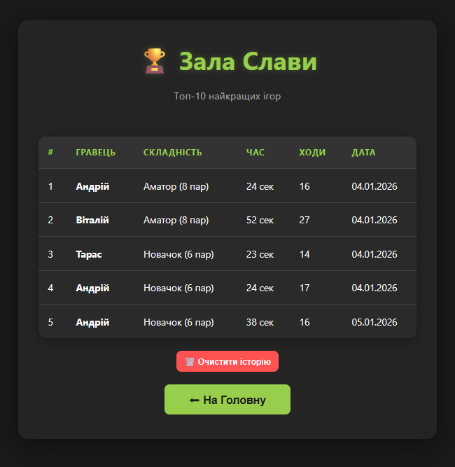

# 🧠 Rick and Morty: Memory Game

### 🎮 [ВІДКРИТИ ГРУ ОНЛАЙН (DEMO)](https://andrii-o-ivanov.github.io/memory-cards/)

Цей проєкт — це кросплатформна гра на розвиток пам'яті (Memory Cards), реалізована на базі бібліотеки React. Тематика гри присвячена персонажам мультсеріалу "Рік та Морті".

---

## 📸 Огляд інтерфейсу

**1. Головне меню**
Екран авторизації гравця та вибору одного з трьох рівнів складності.


**2. Ігровий процес**
Інтерактивне поле з картками персонажів, що завантажуються з API. Включає таймер та лічильник ходів.


**3. Результати гри**
Модальне вікно з фінальною статистикою гравця після успішного завершення раунду.


**4. Зала слави (Leaderboard)**
Таблиця найкращих результатів, реалізована за допомогою LocalStorage для збереження прогресу.


---

## 🚀 Основні можливості та реалізація
- **Робота з API:** Картки персонажів завантажуються динамічно з [The Rick and Morty API](https://rickandmortyapi.com/).
- **Керування станом (State Management):** Використано **Redux Toolkit** для глобального керування ігровим циклом та списком рекордів.
- **Рівні складності:**
  - Новачок (6 пар)
  - Аматор (8 пар)
  - Профі (12 пар)
- **Збереження даних:** Реалізовано постійне зберігання таблиці лідерів у **LocalStorage**.
- **Розумне сортування:** Рекорди автоматично сортуються за складністю (пріоритет), мінімальним часом та кількістю ходів.
- **Маршрутизація:** Використано **React Router (HashRouter)** для стабільної роботи переходів між сторінками на GitHub Pages.

## 🛠 Технологічний стек
- **Frontend:** React 18 + Vite
- **State Management:** Redux Toolkit
- **Routing:** React Router DOM
- **Deployment:** GitHub Pages
- **Styles:** Custom CSS3 (Dark Mode & Animations)

## 💻 Як запустити проєкт локально
Щоб розгорнути проєкт на локальній машині, виконайте наступні кроки:

1. Клонуйте репозиторій:
   ```bash
   git clone https://github.com/Andrii-O-Ivanov/memory-cards.git
2. Перейдіть у папку проєкту:
    ```bash
    cd memory-cards
3. Встановіть необхідні залежності:
    ```bash
    npm install
4. Запустіть сервер розробки:
    ```bash
    npm run dev